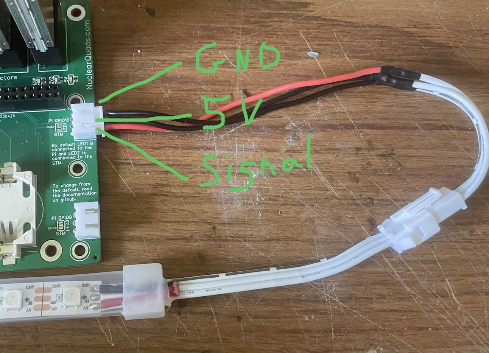

# NuclearHazard Core Kit Hardware Setup

## Troubleshooting
Having trouble with your NuclearHazard timer? Look for your issue [Troubleshooting](../troubleshooting/troubleshooting) page. If your problem isn't listed, search or ask on the <a href="https://discord.gg/ANKd2pzBKH" target="_blank">RotorHazard discord</a> for the best response.

## Required Parts

Along with the kit, you should also have the following ready to use:
- Raspberry Pi (Version 3 or Zero 2 minimum)
- 8+GB Micro SD card for the Pi (instructions for installing the OS below)
- 1-8 RX5808s
- XT60 power supply (battery or other DC power supply works)

## Case Printing

### Case STL Files
- <a href="https://cad.onshape.com/documents/c21f8ac03c166bed0d6faeab/w/4bf3b280307091cb20025cb6/e/8e522757019b78bf199024ba" target="_blank">Version 7</a>
- <a href="https://cad.onshape.com/documents/c21f8ac03c166bed0d6faeab/w/4bf3b280307091cb20025cb6/e/5fcbd1b7334123f6e5ad0816" target="_blank">Version 8</a> (For the "shorty" version, use the configuration dropdown in the top left)

Check your NuclearHazard PCB version, which should be printed on the PCB. The link above takes you to the onshape project where the case for each version is always up to date. Find the case version number with your PCB version. To download:
- Navigate to the correct version number folder on the **bottom bar**
- Right click the "NuclearHazard vX" tab
- Click Export
- Check "Export unique parts as individual files"
- Click Export.

When importing the **lid** into your slicer, it should be turned upside down to avoid needing supports.

Print with support only on the completely horizontal overhangs of the case. The PrusaSlicer setting for this is "Overhang threshold". Set it to 1. Using a "Top/bottom contact Z distance" of twice your layer height (0.4mm for 0.2mm layer height) will make the supports easy to remove. In Bambu or Orca slicer, use paint-on supports only on the long overhang for the Pi connector.

## Pi OS

Prepare an SD card with a modern, fresh Raspberry Pi OS installation. [Raspberry Pi OS installation instructions here.](../instructions/piosinstallation) Make sure to use NuclearHazard as the username for easy setup later. Insert the SD card into the Pi, then begin assembling the timer.

## Pi/Case Installation

Install the board by inserting the XT60 connector into its slot then lower the whole PCB in. Slide it around until the bottom of the PCB is under the small clip built into the case and the screw holes line up. Use two of the short screws in the top screw holes. Use a short screw and firmly push the screw into the hole as you screw it in. Don't over-tighten the screws. Once they hold the PCB from moving around, they're tight enough. Insert the Pi as described above. Use 4 long screws to secure the fan to the lid, exhausting through the lid. Plug the fan into the main PCB, then use 4 short screws to secure the lid to the case.

Note: the battery slot is not currently used by the software.

## RX Installation

Since I no longer sell RXs with the NuclearHazard kits, you'll have to order and solder your own. The following sellers have been reliable for me and haven't needed the SPI mod. Search AliExpress or Ebay for "RX5808" and choose a cheap one.

Start by tinning one pad of the RX carrier with solder. **Be very careful to not get any solder on the connector pads!** Align all the pads of the RX and reheat the tinned pad to reflow the solder. Keep holding the RX aligned until the solder is hardened. That'll hold it still while you solder the rest of the pads.

Some of the RX carrier cards included with Version 3 and 4 need to be inserted backwards. They can be identified by the bigger alignment dot, or if the RXs aren't changing channels. This has since been fixed and the carrier cards included with Version 5+ can be aligned normally.

If the RXs are not recognized by RotorHazard, wiggle the carrier cards and repower the timer.

# NuclearHazard Core Kit Software Setup

Make sure the timer is powered with the XT60. If you power the Pi directly, the rest of the timer will not have power and that will cause problems.

SSH to the Pi. Use [this guide](ssh) if you're unfamilier with SSH.

Run this command, which will download and run this script
```curl -s https://nuclearquads.github.io/files/nhpisetup.sh | bash -s nuclearwifi```

Or this one which will disable the NuclearHazard wifi network
```curl -s https://nuclearquads.github.io/files/nhpisetup.sh | bash```

The default passwords are on the [RotorHazard Usage](../rhusage/rhusage) page.

# Alternative Software Setup

If you'd rather download a large pre-made OS image and flash it to the SD card, follow the instructions [here](../troubleshooting/flash).

# Extra Instructions (if needed)

## Updating RotorHazard

If you used my script to set up the Pi, update by powering on in range of the wifi you originally set up in the Pi Imager. Then you'll need to find the IP of the Pi (the "iNet" iOS app is what I use). SSH to that IP and use the <a href="https://github.com/RotorHazard/RotorHazard/blob/main/doc/Software%20Setup.md#updating-an-existing-installation" target="_blank">updating instructions in the RotorHazard docs</a>.

## POE

Watch the video <a href="https://www.youtube.com/watch?v=APZOm1ioYCY" target="_blank">here</a>

Suggested POE Splitter:

<a href="https://www.aliexpress.us/item/3256804960597428.html" target="_blank">aliexpress</a>

<a href="https://www.amazon.com/Splitter-Compliant-Surveillance-5-5x2-1mm-PS5712TG/dp/B08HS4NT13/" target="_blank">amazon</a>

## LED Strip

The pinout for the LED strip connector is like this.


