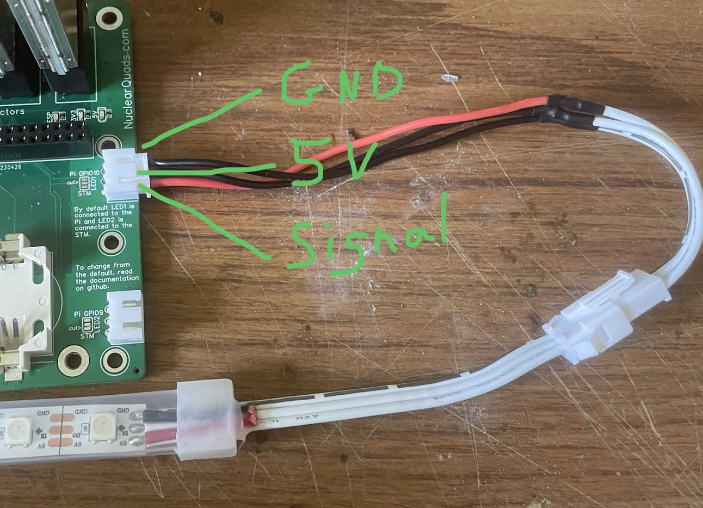

# NuclearHazard Fission Kit Hardware Setup

This is for the newer Fission timer. Instructions for the [NuclearHazard Core kit are here](corekitinstructions.md).

## Troubleshooting
Having trouble with your NuclearHazard timer? Look for your issue [Troubleshooting](../troubleshooting/troubleshooting) page. If your problem isn't listed, search or ask on the <a href="https://discord.gg/ANKd2pzBKH" target="_blank">RotorHazard discord</a> for the best response.

## Assembly Video

<iframe width="560" height="315" src="https://www.youtube.com/embed/tM1rbcJIsiM?si=qCgMjoYQ1aNPzCkt" title="YouTube video player" frameborder="0" allow="accelerometer; autoplay; clipboard-write; encrypted-media; gyroscope; picture-in-picture; web-share" referrerpolicy="strict-origin-when-cross-origin" allowfullscreen></iframe>

## Required Parts

Along with the kit, you should also have the following ready to use:
- Raspberry Pi (Version 3 or Zero 2 minimum)
- 8+GB Micro SD card for the Pi (instructions for installing the OS below)
- 1-8 RX5808s (Search for `RX5808` on [AliExpress](https://aliexpress.us/w/wholesale-rx5808.html), if given the option, select "no audio" and "with SPI")
- XT60 or PoE power supply (battery or other DC power supply works)

### SD Card Recommendations

These are the SD Cards I have personally tested. I haven't had major problems with any of them. The tests were ran with Raspberry Pi's "agnostics" program on a Pi 4.

#### [PNY 32GB Elite (U1 A1)](https://www.amazon.com/PNY-EliteTM-Accessories-microSDHC-Devices/dp/B0G15VV3T5)
- Sequential write speed 14294 KB/sec (target 10000) - PASS
- Random write speed 675 IOPS (target 500) - PASS
- Random read speed 1825 IOPS (target 1500) - PASS

#### [Silicon Power Elite 32GB (U1)](https://www.amazon.com/Silicon-Power-5-Pack-MicroSD-Adapter/dp/B08G8JVZ1Y)
- Sequential write speed 11289 KB/sec (target 10000) - PASS
- Random write speed 514 IOPS (target 500) - PASS
- Random read speed 1634 IOPS (target 1500) - PASS

#### [TEAMGROUP Micro 32GB (U1)](https://www.amazon.com/TEAMGROUP-Micro-UHS-I-SDHC-SDXC/dp/B09WRJJ419)
- Sequential write speed 14558 KB/sec (target 10000) - PASS
- Random write speed 588 IOPS (target 500) - PASS
- Random read speed 1665 IOPS (target 1500) - PASS

## Case Printing

### Case STL Files
- <a href="https://cad.onshape.com/documents/c21f8ac03c166bed0d6faeab/w/4bf3b280307091cb20025cb6/e/c3b017cac1101ca0438fdd95?renderMode=0&uiState=677da23ca20c7305fdc0d6af" target="_blank">Fission 3D Printed Case</a>

The link above takes you to the onshape project where the case for each version is always up to date. To download:
- Right click the "Fission" tab on the bottom
- Click Export
- Check "Export unique parts as individual files"
- Click Export
- Unzip file and import the case and lid files to your slicer

When importing the **case** into your slicer, it should be turned upside down to avoid needing supports.

Print without support. If you have a multi-color printer, use the fill painting on the bottom of the case to fill in the letters and graphics.

## Pi OS

Prepare an SD card with a modern, fresh Raspberry Pi OS installation. [Raspberry Pi OS installation instructions here.](../instructions/piosinstallation) Make sure to use ```nuclear``` (case sensitive) as the username. Insert the SD card into the Pi, then begin assembling the timer.

## RX Installation

Since I don't sell RXs with the NuclearHazard kits, you'll have to order them and solder them to your Fission PCB. Search AliExpress or Ebay for "RX5808" and choose a cheap listing.

Start by tinning only one pad of each receiver footprint with solder. Align all the pads of the RX and reheat the tinned pad to reflow the solder. Keep holding the RX aligned until the solder is hardened. That'll hold it still while you solder the rest of the pads.

## Pi/Case Installation

- Install the 4 standoffs to the main PCB with 4 M2.5 screws
- Line up the Pi with the Pi connector and press firmly until it's fully seated
- Install the other 4 standoff screws to secure Pi to the standoffs
- Place the top part of the case on your workspace upside down
- Use a soldering iron at 200-250C to press the heat-set inserts into the 4 holes in the case (as shown in instruction video)
- Place fan (blowing into case) over the fan hole
- Use 4 M3x12 screws to attach the fan, but be very careful to not over-tighten the screws
- Plug the fan into the fan connector on the PCB (Sometimes it's nice to tie a loose knot in the wire first)
- Place the PCB upside down into the case, lined up with the case screw holes (Make sure the SD card is in the Pi)
- Put the lid on
- Install the last 4 M3x12 screws until tight

# NuclearHazard Fission Kit Software Setup (Method 1/2)

Make sure the timer is powered with the XT60. If you power the Pi directly, the rest of the timer will not have power and that will cause problems.

SSH to the Pi. Use [this guide](ssh) if you're unfamilier with SSH.

Run this command, which will download and run these scripts

__You must run both of these commands, letting it reboot after the first__

```curl -sL https://nuclearquads.github.io/files/nhpisetup.sh | bash -s nuclearwifi```

When you hear the double beep, it's done rebooting

```curl -sL https://nuclearquads.github.io/files/nhpisetup2.sh | bash```

To disable the nuclear/NuclearHazard wifi, run

```sudo systemctl disable hotspot.service && sudo reboot```.

The default passwords are on the [RotorHazard Usage](../rhusage/rhusage) page.

# Alternative Software Setup (Method 2/2)

If you'd rather download a pre-made OS image and flash it to the SD card, follow the instructions [here](../troubleshooting/flash).

# Extra Instructions (if needed)

## LED Strip

The pinout for the LED strip connector is shown above the connector. "S" stands for "signal" or "serial", and should be connected to the Data/DI/IN pin on your LED strip. 5V is the power output that should be powerful enough to run several hundred standard LEDs. G is common/ground.


