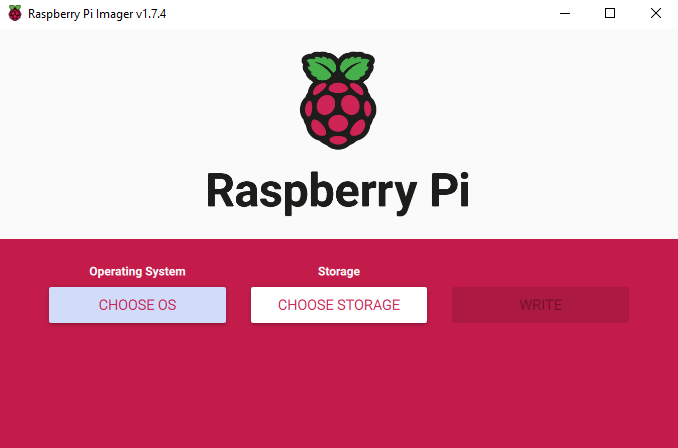
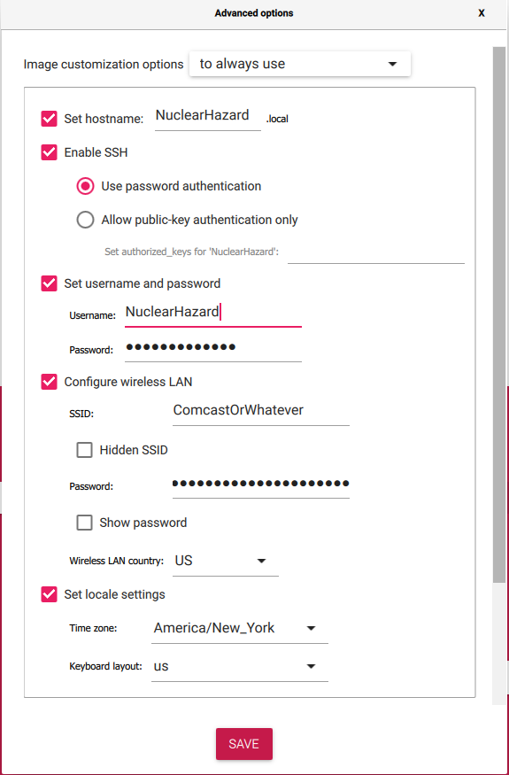

# Pi OS Setup

Use the following instructions to flash the SD card with [Raspberry Pi imager](https://www.raspberrypi.com/software/).

## Select the OS

If you never plan to plug in a monitor directly to the Pi, use the Lite version.

If you're using a Pi Zero 1, Pi 1, or Pi 2, you need a 32-bit OS. Otherwise use 64-bit.

## Select the options

These are the recommended options. The username must be NuclearHazard to easily complete the later setup. The Wi-Fi settings are important for boards without ethernet so you can still SSH to them.

