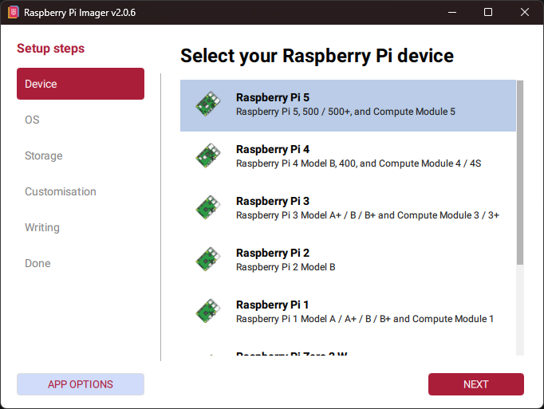
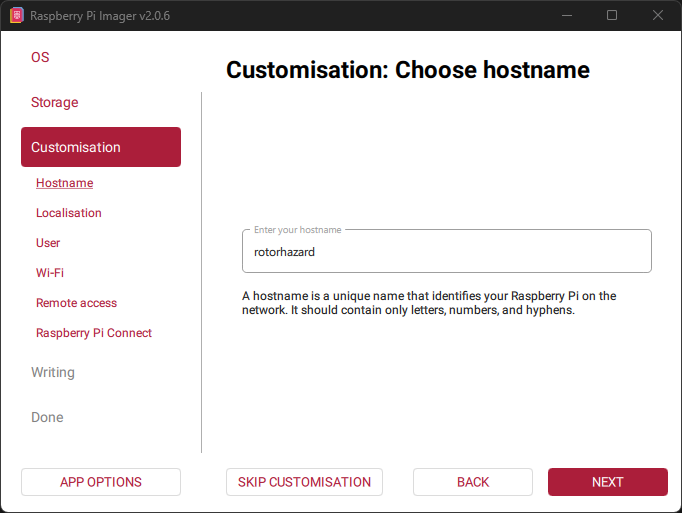

# Pi OS Setup



Use the following instructions to flash the SD card with <a href="https://www.raspberrypi.com/software/" target="_blank">Raspberry Pi imager</a>.

I previously recommended the old version of Imager because any newer doesn't allow upper-case in the username, but I have since changed the default username to work with the latest version.

## Select the OS

If you never plan to plug in a monitor directly to the Pi, use the Lite version.

If you're using a Pi Zero 1, Pi 1, or Pi 2, you need a 32-bit OS. Otherwise use 64-bit.

## Select the options

Some of the "Customization" options are necessary for the scripts and instructions to work. Use the options in the images below for the relevant options. The username must be ```nuclear``` to easily complete the later setup.




