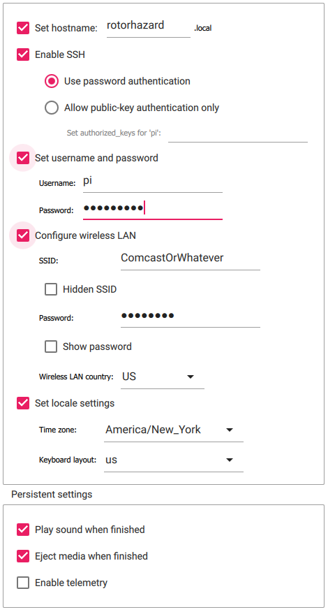

# Pi OS Setup

Flash the SD card with [Raspberry Pi imager](https://www.raspberrypi.com/software/) as follows:

## Select the OS
If you never plan to plug in a monitor, use a Lite version.

If you're using a Pi Zero 1, Pi 1, or Pi 2, you need a 32-bit OS. Otherwise use 64-bit.

## Select the options

These are the recommended options. The username and password will be needed to do the initial setup. The Wi-Fi settings are important for boards without ethernet so you can still SSH to them.

