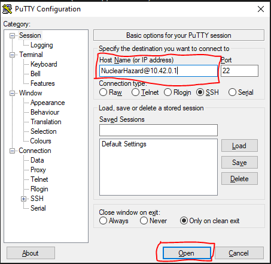

## Version 8 PCB

V8 uses the V7 RX carrier cards.

Changes since V7:
- New layout for slightly smaller case
- Added INA219 which works with regular setup
- Added 4 RX solder pads on bottom of main board so a slim timer can be built without RX connector cards
- Added vin 2.54mm header for theoretical PoE applications

## ESP32 Pinout Wrong

In PCB versions 6 and lower, the footprint for the ESP32 is wrong so it will never work. If you want to use an ESP32 on these boards, you will probably need to solder wires to the bottom of the Pi header. This is expected to be fixed in version 7.

## RX cards don't always connect the first time

If your timer doesn't show all the RXs, try replugging, or just pushing the carrier card into the connector harder, then replug the timer

## Can't flash STM32

One possible cause is that the UART stuff isn't setup right in the config.txt because in a certain Pi OS update, they changed the file path from /boot/config.txt to /boot/firmware/config.txt.

To check if that's the problem, check the file with `sudo nano /boot/firmware/config.txt`.

If you don't see a line that contains `dtoverlay=gpio-shutdown,gpio_pin=18,debounce=5000` (should show at least once near the bottom), you'll need to paste this block into your terminal.

```
echo "dtparam=i2c_baudrate=75000
dtoverlay=miniuart-bt
dtoverlay=act-led,gpio=24
dtparam=act_led_trigger=heartbeat

[pi5]
dtoverlay=uart0-pi5
dtoverlay=i2c1-pi5

[pi4]
dtoverlay=gpio-shutdown,gpio_pin=18,debounce=5000

[pi3]
dtoverlay=gpio-shutdown,gpio_pin=18,debounce=5000
core_freq=250

[pi02]
dtoverlay=gpio-shutdown,gpio_pin=18,debounce=5000
core_freq=250

[all]" | sudo tee -a /boot/firmware/config.txt
```

## Version 7 PCB

The card edge connectors went out of stock, so I changed the design to use 12-pin connectors instead of the previous 10-pin ones. This means the carrier cards aren't cross compatible. Because of the extra pins, this can be inserted either direction so there is no alignment dot. The pads for the unused RX contacts have also been removed for easier soldering.

Since the Pi 5 has a built-in RTC, the RTC battery slot on the board has been removed. Use the Pi 5's one if possible. If an older Pi needs a RTC, use the header for the adafruit RTC module.

## Can't open timer webpage

If your timer powers on and beeps but doesn't let you access the webpage after connecting to the wifi, something is likely corrupted and is stopping the server from starting.

To see what the problem is, you'll need to [SSH to the Pi](../instructions/ssh).

Connect your computer to the NuclearHazard wifi network, open PuTTY, and connect like shown in this picture.



To check whether the server is started or what errors are stopping it do `sudo systemctl status rotorhazard`. Some text will probably be cut off, so resize the PuTTY window and run the command again to see it all.

To clear the RotorHazard database (in case it's become corrupted) to `rm RotorHazard/src/server/database.db`. Then restart the timer. This will remove any pilots, events, heats, classes, etc that you've set up.

If it's still not working, follow the instructions to [reflash your SD card](../troubleshooting/flash).